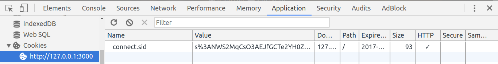

# Session, Cookie
## Định nghĩa về cookie:
* Cookie là một đoạn văn bản mà một Web server có thể lưu trên ổ cứng của người dùng. Cookie cho phép một website lưu các thông tin trên máy tính của người dùng và sau đó lấy lại nó. Các mẩu thông tin sẽ được lưu dưới dạng cặp tên – giá trị (key-value).
* Trên cùng một trình duyệt mỗi một domain khác nhau sẽ có một cookie khác nhau.
* Bạn cũng cần lưu ý rằng khi bạn truy cập một domain trên nhiều tab khác nhau của cùng một trình duyệt thì trình duyệt này cũng chỉ sử dụng một file cookie duy nhất cho domain trên

## Cookie được tạo ra như thế nào?
* Khi truy cập 1 trang web lần đầu tiên, thì trang web đó(server) sẽ tạo ra 1 session với 1 cookie mới tương ứng với session đó và gửi cookie đó cho trình duyệt thông qua response header, trình duyệt sẽ lưu lại cookie này. Nói rõ hơn là mỗi session được tạo ra thì cần phải có một cookie tương ứng với nó để xác định xem session này được sử dụng cho trình duyệt nào.

## Các website sử dụng cookie như thế nào?

* Một cookie cho phép một website có thể lưu các thông tin về trạng thái trên máy tính của bạn. Thông tin này cho phép một website có thể nhớ trạng thái của trình duyệt của bạn là gì.

### Một số trường hợp thường được sử dụng với cookie:
1. Xác định một cách chính xác số lượng người truy cập site. Chỉ có một cách để site có thể đếm chính xác số lượng khách truy cập là thiết lập một cookie với một ID duy nhất cho mỗi khách. Sử dụng cookie, các site có thể xác định:
    * Có bao nhiêu khách truy cập đến.
    * Có bao nhiêu khách truy cập mới và khách truy cập lặp lại.
    * Tần suất một khách truy cập vào trang.
* Cách một website có thể thực hiện điều này là bằng sử dụng cơ sở dữ liệu. Lần đầu khi một khách truy cập đến, site sẽ tạo một ID (`session`) mới trong cơ sở dữ liệu và gửi ID dưới dạng một cookie. Lần sau khi người dùng này truy cập trở lại, site có thể tăng số đếm có liên quan với ID trong cơ sở dữ liệu và biết số lần khách truy cập vào trang.

2.  Site có thể lưu các sở thích người dùng để thể tạo sự khác biệt giữa các khách truy cập (có thể nói website cho phép bạn có khả năng tùy chỉnh).
* Cho ví dụ, nếu bạn truy cập msn.com, nó sẽ cung cấp cho bạn khả năng thay đổi nội dung, giao diện và màu sắc. Nó cũng cho phép bạn nhập vào zip code và có thể  nhận được các thông tin về dự báo thời tiết theo khu vực. Khi bạn nhập vào zip code, gặp giá trị key-value sau sẽ được thêm vào file cookie của MSN.

3. Các site thương mại điện tử có thể thực hiện các nhiệm vụ khác như các tùy chọn giỏ hàng và thanh toán
* Cookie sẽ gồm một ID và cho phép site giữ liên hệ với bạn khi bạn cần thêm những thứ khác vào giỏ hàng của mình. Mỗi một thứ mà bạn thêm vào giỏ hàng được lưu lại trong cơ sở dữ liệu của site cùng với giá trị ID (ID lúc này là session) của bạn. Khi bạn thanh toán, site biết những gì có trong giỏ hàng của bạn bằng cách lấy về tất cả các thông tin cần thiết từ cơ sở dữ liệu

### Các vấn đề với cookie.
[Tham khảo](https://quantrimang.com/internet-cookies-lam-viec-nhu-the-nao-70733)

## Định nghĩa về session:
* Session là một tập tin nhỏ được lưu trữ trên server, mỗi một file session sẽ tương ứng với một file cookie.
* Là một khái niệm phổ biến được dùng trong lập trình các website có kết nối với cơ sở dữ liệu database. Đặc biệt các chức năng như đăng nhập, đăng xuất người dùng sẽ khó có thể thực hiện được nếu không sử dụng `session`.

###  Lý do session được ra đời (Tại Sao Cần Dùng Session):
* Việc giao tiếp giữa trình duyệt với máy chủ của website (hay webserver) được thực hiện thông qua hàng loạt các router trên mạng internet. Một vấn đề đặt ra trong quá trình giao tiếp này đó là làm sao để phân được giữa cá trình duyệt (máy tính) khác nhau. Ví dụ như bạn truy cập một trang bán hàng thì máy chủ cần:
    * Phân biệt được các máy tính (trình duyệt) khác nhau: nói cách khác máy chủ cần phân biệt được trong những lượt truy cập gửi tới máy chủ thì đâu là từ máy tính bạn và đâu là của người khác.
    * Lưu thông tin của giỏ hàng: ví dụ như thông tin về số lượng hàng hoá bạn đã thêm vào giỏ hàng

* Bạn có thể tuỳ ý quyết định xem nên lưu trữ những thông tin nào vào Session. Nhưng thông thường chúng ta chỉ nên lưu những thông tin tạm thời trong session ví dụ như số lượng sản phẩm người dùng đã thêm vào giỏ nhưng chưa mua, hay những nhật xét đang được viết và lưu dưới dạng nháp nhưng chưa gửi đi. Những dữ liệu sử dụng lâu dài như nội dung nhận xét đã được gửi đi hay số sản phẩm đã được mua thì nên được thực hiện ở máy chủ chứa cơ sở dữ liệu. 

### Làm Sao Để Phân Biệt Session Của Các Trình Duyệt Khác Nhau.
* Sau khi chúng ta (các lập trình viên website) tạo ra một tập tin `session` trên máy chủ để lưu trữ dữ liệu tạm thời của người dùng thì chúng ta cần phải phân biệt được `session` nào là của người dùng nào. Để làm điều này thì với mỗi `session` tạo ra chúng ta cần tạo một `cookie` trên trình duyệt của người dùng tương ứng với nó.`Cookie` là một mẩu tin nhỏ có thể được `trình duyệt tạo ra` khi người dùng duyệt web và dùng để lưu trữ thông tin của người dùng ở phía trình duyệt (phía máy khách).
* `Cookie` có thể được tạo ra mà không yêu cầu cần phải tạo ra 1 `session` trên server tương ứng với nó. Tuy nhiên mỗi `session` được tạo ra thì cần phải có một cookie tương ứng với nó để xác định xem `session` này được sử dụng cho trình duyệt nào. Nhờ sử dụng `cookie` mà chúng ta có thể phân biệt được giữa các `session` khác nhau của các trình duyệt khác nhau.   

## Link tham khảo:
* http://www.codehub.vn/Giai-Thich-Su-Khac-Nhau-Giua-Session-va-Cookie-Danh-Cho-Nguoi-Khong-Ranh-Ve-Lap-Trinh

* http://www.codehub.vn/Session-La-Gi

* https://quantrimang.com/internet-cookies-lam-viec-nhu-the-nao-70733

* https://viblo.asia/p/tim-hieu-ve-session-va-cookie-E375zBqd5GW

* https://techtalk.vn/session-va-cookies.html

# Cookie, session trong node.js
### Sử dụng session-express trong ứng dụng node.js
* Session thì không bắt buộc phải lưu trên store, 
* Cấu hình để tạo cookie, session:
```javascript
    app.set('trust proxy', 1)
    app.use(session({
        secret: 'FMS',
        resave: false,
        saveUninitialized: true,
        cookie: { 
            maxAge: 300000,
            secure: false 
        }
    }))
```

* secret: là chữ ký cho session ID cookie và `Required option`.

* cookie.secure: 
    * Khi xét `secure: true` chạy trên phương thức HTTP thì cookie sẽ ko dc lưu trên trình duyệt, cookie đc lưu khi chạy trên phương thức HTTPS 

     `Please note that secure: true is a ``recommended`` option. However, it requires an https-enabled website, i.e., HTTPS is necessary for secure cookies. If secure is set, and you access your site over HTTP, the cookie will not be set`
    Khi đó ta phải thêm `trust proxy` trong phần cài đặt express để lưu dc cookie trên trình duyệt khi trên chạy phương thức HTTP

* name: 
    * Là tên của session ID cookie được truyền vào response gửi cho client khi mà client gửi requset đầu tiên tới máy chủ (lần đầu tiên truy cập vào trang web).
    *  Default value của cookie trên trình duyệt là `connect.sid`
    

        `The name of the session ID cookie to set in the response (and read from in the request).`

* resave: 

* saveUninitialized: 

* req.session:

* req.session.id:
    * Session luôn là unique ID, nó là alias của `req.sessionID` và không thể sửa đổi. Nó được tạo ra từ `object session` với property `secret`

* req.sessionID
